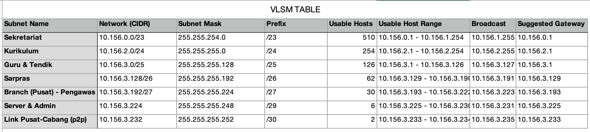
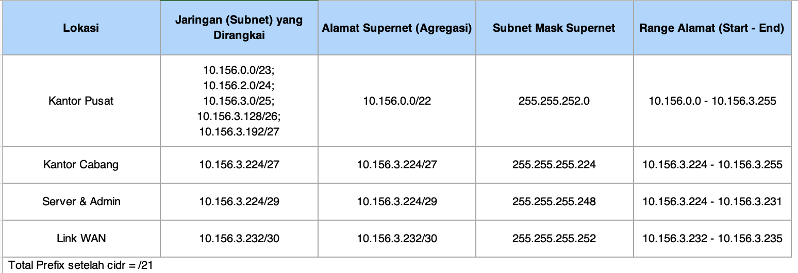
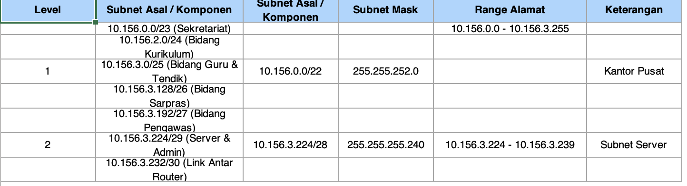

# 📊 Dokumentasi VLSM Network Configuration

Proyek konfigurasi jaringan menggunakan metode VLSM dan CIDR

## 📑 Daftar Isi

- [Overview](#overview)
- [VLSM Table](#vlsm-table)
- [CIDR Configuration](#cidr-configuration)
- [Topologi Jaringan](#topologi-jaringan)
- [Subnetting Detail](#subnetting-detail)
- [Analisis IP](#analisis-ip)

---

## 🎯 Overview

Dokumentasi ini berisi konfigurasi lengkap jaringan dengan 7 subnet berbeda menggunakan metode VLSM untuk optimasi penggunaan IP address.

**Base Network:** `10.156.0.0/21`

---

## 📊 VLSM Table


=======


Tabel konfigurasi lengkap untuk semua subnet dalam jaringan.

### Detail Subnet

| No | Subnet Name | Network (CIDR) | Subnet Mask | Prefix | Usable Hosts | Usable Host Range | Broadcast | Suggested Gateway |
|----|-------------|----------------|-------------|--------|--------------|-------------------|-----------|-------------------|
| 1 | **Sekretariat** | 10.156.0.0/23 | 255.255.254.0 | /23 | 510 | 10.156.0.1 - 10.156.1.254 | 10.156.1.255 | 10.156.0.1 |
| 2 | **Kurikulum** | 10.156.2.0/24 | 255.255.255.0 | /24 | 254 | 10.156.2.1 - 10.156.2.254 | 10.156.2.255 | 10.156.2.1 |
| 3 | **Guru & Tendik** | 10.156.3.0/25 | 255.255.255.128 | /25 | 126 | 10.156.3.1 - 10.156.3.126 | 10.156.3.127 | 10.156.3.1 |
| 4 | **Sarpras** | 10.156.3.128/26 | 255.255.255.192 | /26 | 62 | 10.156.3.129 - 10.156.3.190 | 10.156.3.191 | 10.156.3.129 |
| 5 | **Branch (Pusat) - Pengawas** | 10.156.3.192/27 | 255.255.255.224 | /27 | 30 | 10.156.3.193 - 10.156.3.222 | 10.156.3.223 | 10.156.3.193 |
| 6 | **Server & Admin** | 10.156.3.224/29 | 255.255.255.248 | /29 | 6 | 10.156.3.225 - 10.156.3.230 | 10.156.3.231 | 10.156.3.225 |
| 7 | **Link Pusat-Cabang (p2p)** | 10.156.3.232/30 | 255.255.255.252 | /30 | 2 | 10.156.3.233 - 10.156.3.234 | 10.156.3.235 | 10.156.3.233 |

### Penjelasan Kolom:

- **Subnet Name**: Nama lokasi/departemen
- **Network (CIDR)**: Alamat network dengan notasi CIDR
- **Subnet Mask**: Subnet mask dalam format desimal
- **Prefix**: Panjang prefix dalam notasi /XX
- **Usable Hosts**: Jumlah host yang dapat digunakan
- **Usable Host Range**: Range IP yang dapat dialokasikan ke host
- **Broadcast**: Alamat broadcast untuk subnet
- **Suggested Gateway**: Rekomendasi IP untuk gateway (biasanya IP pertama)

---

## 🗂️ CIDR Configuration



Ringkasan konfigurasi CIDR untuk agregasi subnet berdasarkan lokasi.

### Agregasi per Lokasi

| Lokasi | Jaringan (Subnet) yang Dirangkai | Alamat Supernet (Agregasi) | Subnet Mask Supernet | Range Alamat (Start - End) |
|--------|----------------------------------|----------------------------|----------------------|----------------------------|
| **Kantor Pusat** | 10.156.0.0/23<br>10.156.2.0/24<br>10.156.3.0/25<br>10.156.3.128/26<br>10.156.3.192/27 | 10.156.0.0/22 | 255.255.252.0 | 10.156.0.0 - 10.156.3.255 |
| **Kantor Cabang** | 10.156.3.224/27 | 10.156.3.224/27 | 255.255.255.224 | 10.156.3.224 - 10.156.3.255 |
| **Server & Admin** | 10.156.3.224/29 | 10.156.3.224/29 | 255.255.255.248 | 10.156.3.224 - 10.156.3.231 |
| **Link WAN** | 10.156.3.232/30 | 10.156.3.232/30 | 255.255.255.252 | 10.156.3.232 - 10.156.3.235 |

**Catatan:** Total prefix setelah cidr = /21

### Penjelasan CIDR:

CIDR (Classless Inter-Domain Routing) digunakan untuk:
- Menggabungkan beberapa subnet menjadi satu supernet
- Menyederhanakan routing table
- Mengurangi ukuran routing table di router

---

## 🌐 Topologi Jaringan


Diagram topologi menunjukkan koneksi antar subnet dan routing dalam jaringan.

### Struktur Topologi:
```
                    [Router Cabang]
                           |
                    10.156.3.232/30
                      (Link P2P)
                           |
                    [Router Pusat]
                           |
        +------------------+------------------+
        |                  |                  |
   [Sekretariat]      [Kurikulum]    [Guru & Tendik]
   10.156.0.0/23      10.156.2.0/24   10.156.3.0/25
        |                  |                  |
        +------------------+------------------+
                           |
        +------------------+------------------+
        |                  |                  |
    [Sarpras]      [Branch-Pengawas]  [Server & Admin]
  10.156.3.128/26   10.156.3.192/27   10.156.3.224/29
```

### Komponen Jaringan:

1. **Router Pusat** - Core router yang menghubungkan semua subnet
2. **Router Cabang** - Router untuk koneksi ke kantor cabang
3. **Subnet Departemen** - Sekretariat, Kurikulum, Guru & Tendik, Sarpras
4. **Subnet Khusus** - Branch Pengawas, Server & Admin
5. **Link P2P** - Koneksi point-to-point antar router

---

## 📋 Subnetting Detail



Detail pembagian subnet berdasarkan level hierarki.

### Level 1: Kantor Pusat

| Level | Subnet Asal / Komponen | Subnet Asal / Komponen | Subnet Mask Supernet | Range Alamat | Keterangan |
|-------|------------------------|------------------------|----------------------|--------------|------------|
| - | 10.156.0.0/23 (Sekretariat)<br>10.156.2.0/24 (Bidang Kurikulum) | 10.156.0.0/22 | 255.255.252.0 | 10.156.0.0 - 10.156.3.255 | **Kantor Pusat** |

**Komponen Kantor Pusat:**
- Sekretariat (10.156.0.0/23)
- Bidang Kurikulum (10.156.2.0/24)
- Bidang Guru & Tendik (10.156.3.0/25)
- Bidang Sarpras (10.156.3.128/26)
- Bidang Pengawas (10.156.3.192/27)

### Level 2: Subnet Server & Link

| Level | Subnet Asal / Komponen | Subnet Asal / Komponen | Subnet Mask Supernet | Range Alamat | Keterangan |
|-------|------------------------|------------------------|----------------------|--------------|------------|
| 1 | 10.156.3.0/25 (Bidang Guru & Tendik)<br>10.156.3.128/26 (Bidang Sarpras) | 10.156.0.0/22 | 255.255.252.0 | - | Kantor Pusat |
| 2 | 10.156.3.224/29 (Server & Admin)<br>10.156.3.232/30 (Link Antar Router) | 10.156.3.224/28 | 255.255.255.240 | 10.156.3.224 - 10.156.3.239 | **Subnet Server** |

**Hierarki Subnetting:**
```
Level 0: Master Network (10.156.0.0/21)
    |
    ├─ Level 1: Kantor Pusat (10.156.0.0/22)
    │   ├─ Sekretariat (/23)
    │   ├─ Kurikulum (/24)
    │   ├─ Guru & Tendik (/25)
    │   ├─ Sarpras (/26)
    │   └─ Branch Pengawas (/27)
    │
    └─ Level 2: Subnet Khusus
        ├─ Server & Admin (/29)
        └─ Link P2P (/30)
```

---

## 📈 Analisis IP

### Ringkasan Penggunaan IP

| Kategori | Jumlah | Persentase |
|----------|--------|------------|
| **Total IP Available** | 2,048 | 100% |
| **IP Used (Usable Hosts)** | 990 | 48.3% |
| **IP Reserved (Network + Broadcast)** | 14 | 0.7% |
| **IP Available untuk Growth** | 1,044 | 51% |

### Distribusi IP per Subnet
```
Sekretariat:        510 hosts (25.0%)
Kurikulum:          254 hosts (12.4%)
Guru & Tendik:      126 hosts (6.2%)
Sarpras:             62 hosts (3.0%)
Branch-Pengawas:     30 hosts (1.5%)
Server & Admin:       6 hosts (0.3%)
Link P2P:             2 hosts (0.1%)
────────────────────────────────────
Total Used:         990 hosts (48.3%)
```

### Efisiensi VLSM

✅ **Keuntungan:**
- Penggunaan IP yang efisien
- Minimal IP waste
- Skalabilitas terjaga
- Clear segmentation

📊 **Waste IP:**
- Total waste: ~1% dari total IP
- Sangat efisien untuk organisasi dengan kebutuhan beragam

---

## 🔧 Cara Penggunaan


### 1. Konfigurasi Router (Contoh)
```cisco
! Interface untuk Sekretariat
interface GigabitEthernet0/0
 ip address 10.156.0.1 255.255.254.0
 no shutdown

! Interface untuk Kurikulum
interface GigabitEthernet0/1
 ip address 10.156.2.1 255.255.255.0
 no shutdown

! Interface untuk Link P2P
interface Serial0/0/0
 ip address 10.156.3.233 255.255.255.252
 no shutdown
```

### 2. Testing Konektivitas
```bash
# Ping dari Sekretariat ke Kurikulum
ping 10.156.2.1

# Traceroute untuk melihat path
traceroute 10.156.3.226
```

---

## 📁 File & Dokumentasi

### File yang Tersedia:

- `topologi_116.pkt` - File Cisco Packet Tracer dengan konfigurasi lengkap
- `well.xlsx` - Excel file dengan 4 sheet:
  - **vlsm**: VLSM TABLE lengkap
  - **cidr**: CIDR Configuration
  - **topologi**: Network Topology Diagram
  - **subnetting**: Subnetting Detail

## 📝 Catatan Penting

### Aturan Penggunaan IP:

1. **Gateway** menggunakan IP pertama dari range usable hosts
2. **Network Address** tidak dapat digunakan untuk host
3. **Broadcast Address** tidak dapat digunakan untuk host
4. **Usable Host Range** adalah IP yang dapat dialokasikan ke device

### Planning untuk Growth:

| Subnet | Current Usage | Max Hosts | Growth Capacity |
|--------|---------------|-----------|-----------------|
| Sekretariat | 510 | 510 | 0% (perlu upgrade ke /22) |
| Kurikulum | 254 | 254 | 0% (perlu upgrade ke /23) |
| Guru & Tendik | 126 | 126 | 0% (perlu upgrade ke /24) |
| Sarpras | 62 | 62 | 0% (perlu upgrade ke /25) |
| Branch-Pengawas | 30 | 30 | 0% (perlu upgrade ke /26) |
| Server & Admin | 6 | 6 | 0% (sudah cukup) |

